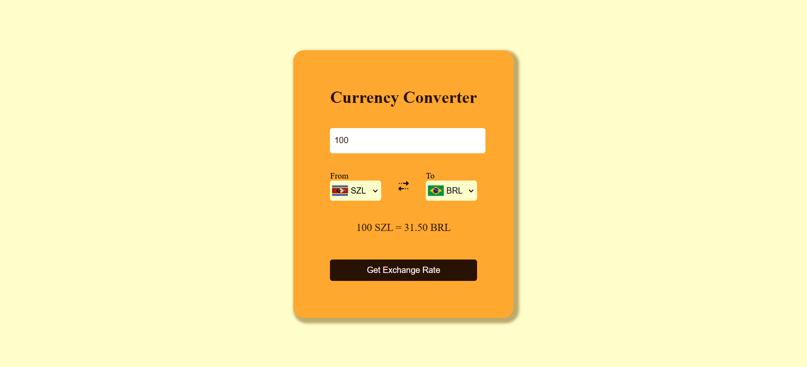
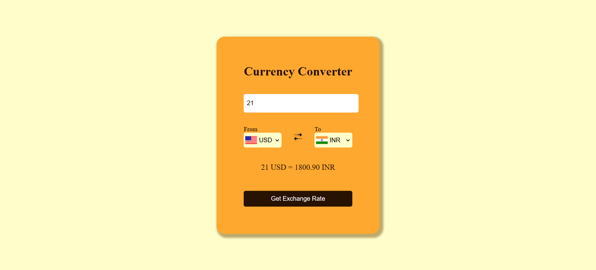

🌍 Currency Converter
A simple and interactive Currency Converter web application that allows users to convert one currency to another using real-time exchange rates.

🚀 Features
- Real-time exchange rates using ExchangeRate-API
- Dropdown selection for choosing currencies
- Automatic flag updates based on the selected currency
- Secure API key handling with Netlify environment variables

📸 Screenshots

🛠️ Technologies Used
- HTML - Structure of the application
- CSS (Tailwind or Vanilla CSS) - Styling the UI
- JavaScript (Vanilla JS) - Fetching exchange rates & handling user interactions
- ExchangeRate-API - Provides live currency exchange rates
- Netlify - Hosting and managing environment variables

Live Demo - (https://currency-converter-mini-project.netlify.app/)
